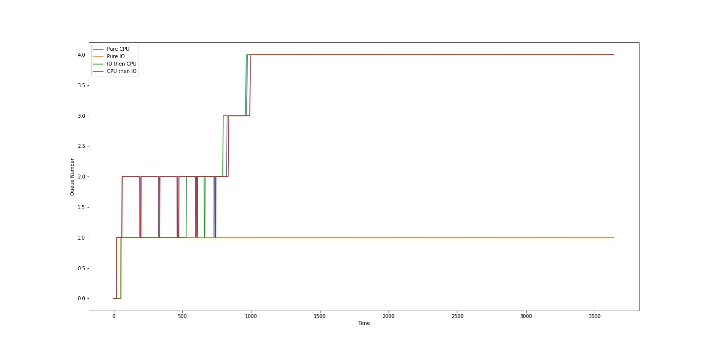

## IMPLEMENTATION OF ADDITIONAL FEATURES

### ```waitx``` system call
  
- The variable ```rtime``` stores the total runtime of the process. This is incremented after each clock tick the 
  process runs (on timer interrupt).
- The variable ```iotime``` stores the total time the process spends waiting for input/output. This is incremented 
  after each clock tick the process sleeps (on timer interrupt).
- The total waiting time of the process is calculated using the formula:  
  ```total_wait_time = end_time - total_run_time - total_io_time - creation_time```
  
### ```ps``` user program

- This makes use of the ```procinfo``` system call which prints out the details of every process in the operating 
  system, obtained directly from the process structure.
- ```n_run``` is incremented just before a process starts running on a CPU.
- ```w_time``` is the amount of time the process has been waiting:
  - For a CPU to run on, if the process is runnable.
  - For it to be woken up, if the process is sleeping.
- ```wtime``` is calculated using ```w_time = ticks - q_toe``` where ```ticks``` is the current time and ```ustime``` is the most recent time the 
  process state was changed to ```RUNNABLE``` or ```SLEEPING```. 

### ```FCFS``` scheduler

- The process with the oldest creation time is found by looping over all processes and is run to completion or until it 
  blocks. 
- There is no preemption. This is done by preventing the process from calling ```yield()``` on timer interrupt,
  which causes it to relinquish control of the CPU.
  
### ```PBS``` scheduler

- The highest priority in the system is found by looping over all processes.
- All processes with this priority are scheduled in a Round Robin manner.
- After a process yields control of the CPU on timer interrupt, the highest priority in the system is found again. 
  - If this priority is the same as before, we continue the Round Robin scheduler. 
  - Else, we begin scheduling all processes with the new highest priority by Round Robin.
  
### ```MLFQ``` scheduler

- The priority of the current queue which the process is in is stored in ```cur_q```. There are no actual queues 
  in the implementation.
- The time of entry of a process into a queue is stored in ```q_toe```. Processes with the smallest value of 
  ```q_toe``` will be at the head of the queue.
- We loop over the 5 priorities from highest to lowest (0-4).
- For each priority, we select the process at the head of the queue and run it for a time slice of ```1 << priority``` 
  ticks. This value is stored in ```q_ticks``` of the process and is decremented after every timer interrupt. Once 
  the value of ```q_ticks``` becomes ```0```, it relinquishes control of the CPU.
- If the value of ```q_ticks``` after the process yields the CPU is ```0```, it means that the process used up its 
  entire time slice. Else, the process either exited or blocked before its time slice completed.
- A process which finished its time slice in a queue (except the lowest queue) is moved down to the end of the next 
  queue by incrementing  ```cur_q``` and resetting ```q_toe``` to be equal to ```ticks```. 
- For a process which did not use up its entire time slice, ```q_toe``` is reset to ```ticks``` when the process 
  becomes runnable again, hence moving it to the end of the same queue once it wakes up.
- For a process in the lowest queue which used up its time slice, ```cur_q``` remains the same and ```q_toe``` is reset.
  Hence Round Robin is automatically implemented for the lowest queue.
- After a process uses up its time slice, we loop over all processes in the system and implement aging. If a process
  has waited for the CPU for more than ```2 ^ (5 + time slice)``` ticks, it is moved to the end of the previous queue 
  (with higher priority) by decrementing ```cur_q``` and resetting ```q_toe``` to ```ticks```.
- If at least one process aged, we start looping again from the head of the highest priority (```0```), to account for
  possible new entries in higher priority queues. Else, we schedule the next process at the head of the current queue.
- Once the current queue from which we are scheduling processes becomes empty, we begin scheduling processes from the 
  head of the next (lower priority) queue.
- NOTE: In this implementation, a process which relinquishes the CPU before completion of its time slice will be 
  inserted to the end of its current queue, and will not be sent to the next lower queue. This can be exploited as a
  process in a high priority queue can relinquish the CPU on purpose before using up its time slice in that queue, and 
  hence remain in the same queue forever without ever being pushed down to a lower priority queue.

## PERFORMANCE OF SCHEDULING ALGORITHMS

The performance of the 4 scheduling algorithms has been tested on the [benchmark program](xv6/benchmark.c).  
The total time taken is found by running ```time benchmark```.  

The benchmark program spawns a total of 40 processes, 10 of each of the following types:
- Pure CPU
- CPU followed by IO
- IO followed by CPU
- Pure IO

### ```RR``` scheduler (default)
- Total ticks: 2522
- Processes are executed in a Round Robin manner.  
  
### ```FCFS``` scheduler
- Total ticks: 2828
- Processes are run to completion after being scheduled.

### ```PBS``` scheduler
- Total ticks: 2406
- Odd processes have higher priority than even processes and hence are scheduled first.
- Round Robin between odd processes and then between even processes.

### ```MLFQ``` scheduler
- Total ticks: 2749
- Processes are scheduled based on their current priority queue.


